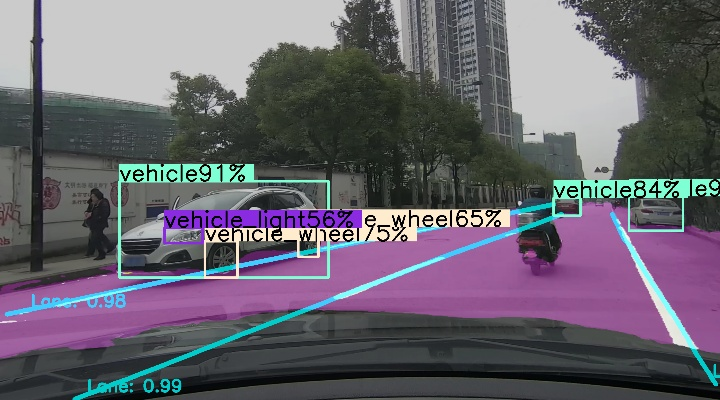

# Multitask Mono Camera Perception - Hydranet
## Introduction
This is my previous work on multitask perception in Forward Camera Settings\
It mainly contains three tasks:  
(1) object detection  
(2) semantic segmentation  
(3) lane detection

 


## How to Run
### model training
```shell
# prepare data in model\data
# then edit config file in model\cfgs then start trainig
python train.py 
```
### model inference in python
```shell
python demo.py # set deploy = False
```

### model deploy and run in c++ using onnxruntime
```shell
# 导出onnx
python demo.py # set deploy = True
python -m onnxsim .\hydraNET.onnx .\hydraNET_simplify.onnx

# 编译运行
cd deploy && mkdir build && cd build && cmake ..
```


